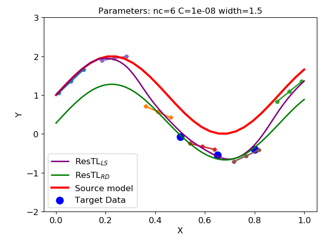

# ResTL: 
Python implementation of [Transfer learning based on fuzzy residual](https://www.baidu.com) for regression transfer. 


## Getting Started
### Package
- skfuzzy is necessary for fuzzy parition

```
pip install scikit-fuzzy
```
### Demon
- demon_curve.py is the curve demon. Given the source model and few targe data, the predicted target model ResTL(LS) and ResTL(RD) will be given.
- demon_live.py is a live demon, you can select any number of target data with mouse.
- demon_dataset.py is the demon for [Kin dataset](http://www.cs.toronto.edu/~delve/data/kin/desc.html)

### Citation
If you use this code for your research, please cite our papers.
```
@inproceedings{
    title={Hypothesis transfer learning based on fuzzy residual},
    author={Chen gengxiang},
    booktitle={Arxiv},
    year={2019},
    url={https://www.baidu.com},
}
```
## Thanks
Thanks for the codes of TSK-FS, from [Peng Xu](6171610015<6171610015@stu.jiangnan.edu.cn>
) and [YuqiCui](https://github.com/YuqiCui)
